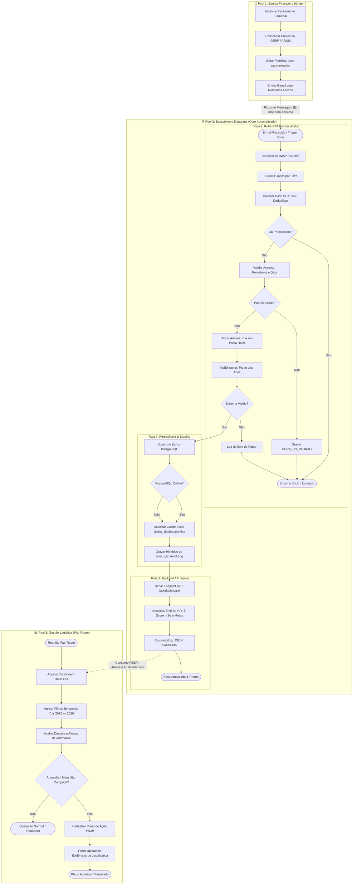
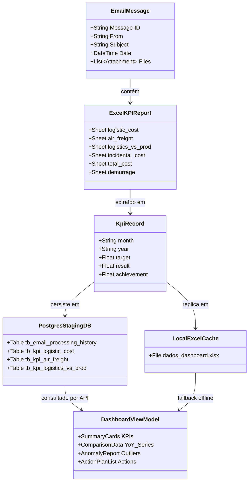

# Especificação e Mapeamento BPMN 2.0 — Processo de KPIs Logísticos

**Projeto:** Plataforma DataLens / Dashboard de KPIs Logísticos  
**Organização:** LG Electronics DXI — Divisão de Logística & Administrativo  
**Versão:** 1.0.0  
**Data:** 21/08/2026  
**Padrão:** OMG Business Process Model and Notation (BPMN 2.0)  
**Arquivo Fonte BPMN:** [`processo_kpi_logistico.bpmn`](file:///c:/Users/ROMULO_LIRA/Documents/prototipo-dashboard/fluxo/processo_kpi_logistico.bpmn)

---

## 1. Visão Geral da Arquitetura de Processos

O processo modelado representa o fluxo de ponta a ponta para captura, saneamento, validação estatística, consolidação e apresentação dos **KPIs Logísticos (War Room Report, Frete Aéreo, Relação Custo/Produção)** na LG Electronics DXI.

O modelo é dividido em **3 Pools (Participantes)** e **3 Swimlanes (Raias)** no núcleo automatizado:

---

## 2. Dicionário de Elementos BPMN

### 2.1. Pools & Swimlanes (Participantes e Raias)

| ID do Elemento | Nome | Tipo | Descrição e Papel |
|---|---|---|---|
| `Participant_Financeiro` | **Equipe Financeira** | Pool Externa (Black Box / Grey Box) | Responsável pela extração preliminar dos dados fiscais/operacionais e envio semanal de e-mails com relatórios. |
| `Participant_DataLens_Core` | **Ecossistema DataLens** | Pool Principal (White Box) | Executa o pipeline tecnológico automatizado de ponta a ponta (RPA, Staging, API). |
| `Lane_RPA` | **Robô RPA Worker** | Swimlane (Python) | Responsável pelo protocolo IMAP, leitura de e-mails, validações de integridade, deduplicação e parsing de planilhas. |
| `Lane_DataStore` | **Persistência & Cache** | Swimlane (SQL / Excel) | Camada de persistência relacional (PostgreSQL) com resiliência local (`dados_dashboard.xlsx`). |
| `Lane_APIServer` | **Servidor API REST** | Swimlane (Flask :5001) | Camada intermediária que fornece endpoints REST e executa regras de consistência estatística. |
| `Participant_Gestao_Logistica` | **Equipe de Gestão Logística** | Pool de Consumo (Usuários-Chave) | Rafael, Ruy e Diretoria da LG DXi no monitoramento, análise de anomalias e planos de ação. |

---

### 2.2. Eventos (Start, Intermediate, End Events)

| ID do Elemento | Tipo de Evento | Gatilho / Categoria | Descrição |
|---|---|---|---|
| `Start_Fin_Semanal` | Start Event | None / Ciclo | Início da consolidação semanal pela equipe contábil/financeira. |
| `StartEvent_EmailRecebido` | Start Event | Mensagem (E-mail) | Disparo acionado pela recepção de novo e-mail na caixa postal monitorada. |
| `StartEvent_TimerCron` | Start Event | Timer / Cron | Disparo por agendamento prévio (ex.: segundas-feiras às 07:00). |
| `EndEvent_PipelineSucesso` | End Event | None | Conclusão com êxito da carga e disponibilização de dados via API. |
| `EndEvent_Ignorado` | End Event | None | Finalização controlada após detecção de duplicidade ou desvio de padrão. |
| `End_Log_ConcluidoComAcao` | End Event | None | Encerramento do War Room com plano de ação e evidências persistidos. |
| `End_Log_ConcluidoSemAcao` | End Event | None | Encerramento do War Room sem necessidade de intervenção corretiva. |

---

### 2.3. Atividades e Tarefas (Tasks)

| ID da Tarefa | Tipo de Tarefa | Responsável / Executor | Descrição Técnica / Regra |
|---|---|---|---|
| `Task_Fin_Consolidar` | Manual Task | Analista Financeiro | Coleta dados dos sistemas legados **GERP** (Produção) e **ARUM** (Fretes). |
| `Task_Fin_GerarExcel` | Manual/App Task | Analista Financeiro | Monta planilhas no formato tabular com colunas `month, year, target, result`. |
| `Task_Fin_EnviarEmail` | Send Task | Analista Financeiro | Envia e-mail para `EMAIL_USER` com assunto contendo `EMAIL_SUBJECT_FILTER`. |
| `Task_RPA_ConectarIMAP` | Service Task | `rpa_email.modules.email` | Abre sessão SSL criptografada no host IMAP na porta 993 com timeout de 30s. |
| `Task_RPA_BuscarEmails` | Service Task | `rpa_email.app.services` | Filtra mensagens no servidor por `SUBJECT`, `FROM`, `SINCE` e `BEFORE`. |
| `Task_RPA_Deduplicar` | Service Task | `rpa_email.app.services` | Gera hash `SHA-256(uid + From + Date + Subject)` ou checa `Message-ID`. |
| `Task_RPA_ValidarPadrao` | Service Task | `rpa_email.app.services` | Valida conformidade rigorosa de remetente, título e janelas de competência. |
| `Task_RPA_RegistrarForaPadrao` | Service Task | `rpa_email.app.repository` | Salva registro de descarte no repositório de histórico para fins de compliance. |
| `Task_RPA_BaixarAnexos` | Service Task | `rpa_email.modules.email` | Grava arquivos em `resources/attachments/<hash_16>/` evitando colisões de nomes. |
| `Task_RPA_ExtrairKPIs` | Service Task | `rpa_email.app.extractor` | `KpiExtractor` processa as abas: `logistic_cost`, `air_freight`, `logistics_vs_prod`, `incidental_cost`, `total_cost`, `demurrage`. |
| `Task_RPA_RegistrarErroParse` | Service Task | `rpa_email.app.repository` | Registra em log o erro de schema (ex.: cabeçalho corrompido ou tipo de dado inválido). |
| `Task_DB_PersistirPostgres` | Service Task | `rpa_email.app.kpi_repository` | Executa `INSERT ... ON CONFLICT (month, year) DO UPDATE` nas tabelas relacionais. |
| `Task_DB_FallbackExcelCache` | Service Task | `rpa_email.app.extractor` | Salva espelho atualizado em `dados_dashboard.xlsx` garantindo tolerância a falhas. |
| `Task_DB_RegistrarAuditLog` | Service Task | `rpa_email.app.repository` | Persiste `EmailRecord(status='PROCESSADO')` no banco de controle. |
| `Task_API_CarregarBase` | Service Task | `api_server.server` | Rota `GET /api/dashboard` carrega do PostgreSQL ou faz failover automático para o Excel. |
| `Task_API_ExecutarAnalytics` | Business Rule Task | `analyticsEngine.js` / API | Calcula variações Year-over-Year, % de atingimento e detecta anomalias estatísticas ($Z\text{-score} > 2\sigma$). |
| `Task_API_ServirDados` | Service Task | `api_server.server` | Serializa e responde JSON estruturado com cabeçalhos CORS liberados. |
| `Task_Log_AcessarDashboard` | User Task | Gestão Logística | Acesso à interface web (React 19 / Power BI Service). |
| `Task_Log_FiltrarPeriodos` | User Task | Gestão Logística | Aplicação de filtros por Ano (Y25/Y26) e Periodicidade (Mês/Trimestre/Semestre/Ano). |
| `Task_Log_AnalisarDesvios` | User Task | Gestão Logística | Inspeção dos cards de KPIs, gráficos de atingimento e badges de anomalia. |
| `Task_Log_CriarPlanoAcao` | User Task | Gestão Logística | Preenchimento do formulário 5W2H (O que, Por que, Quem, Quando, Onde, Como, Quanto). |
| `Task_Log_AnexarEvidencias` | User Task | Gestão Logística | Upload e vinculação de faturas, relatórios de demurrage ou justificativas operacionais. |

---

### 2.4. Portais de Decisão (Gateways Exclusivos - XOR)

| ID do Gateway | Condição de Decisão | Caminho Verdadeiro / Sucesso | Caminho Falso / Exceção |
|---|---|---|---|
| `Gateway_Trigger` | Tipo de acionamento | Recebimento de E-mail | Execução Periódica (Timer) / Manual |
| `Gateway_IsDuplicado` | Hash/Message-ID já existe no banco? | **Sim:** Ignora o processamento e finaliza ciclo. | **Não:** Avança para validação de conteúdo. |
| `Gateway_PadraoValido` | Assunto, remetente e data conferem? | **Sim:** Inicia download de anexos. | **Não:** Registra `FORA_DO_PADRAO` e encerra. |
| `Gateway_TemErrosParse` | Planilha possui estrutura e tipos válidos? | **Sim:** Envia dados para o repositório. | **Não:** Registra log de erro de parse. |
| `Gateway_DB_Sucesso` | Conexão PostgreSQL ativa e responsiva? | **Sim:** Persiste em SQL e atualiza cache. | **Não (Offline):** Grava direto no cache `dados_dashboard.xlsx`. |
| `Gateway_RequerAcao` | Desvio $> 2\sigma$ ou meta estourada? | **Sim:** Obriga cadastro de Plano de Ação 5W2H. | **Não:** Finaliza análise sem pendências. |

---

## 3. Matriz de Fluxos de Dados e Artefatos (Data Objects & Stores)

---

## 4. Rastreabilidade e Conformidade Técnica

1. **Interoperabilidade:** O arquivo [`processo_kpi_logistico.bpmn`](file:///c:/Users/ROMULO_LIRA/Documents/prototipo-dashboard/fluxo/processo_kpi_logistico.bpmn) foi construído conforme a especificação BPMN 2.0 XML da OMG, podendo ser importado sem perdas no **Camunda Modeler**, **Bizagi Process Modeler**, **Signavio** e extensões BPMN do VS Code.
2. **Idempotência Garantida:** Cada execução do Robô RPA gera identificadores determinísticos, garantindo que re-execuções acidentais não dupliquem registros de métricas financeiras.
3. **Resiliência em Duas Camadas:** O fluxo de persistência garante que mesmo se o banco PostgreSQL estiver temporariamente inacessível, o cache local `dados_dashboard.xlsx` manterá o dashboard 100% funcional.
