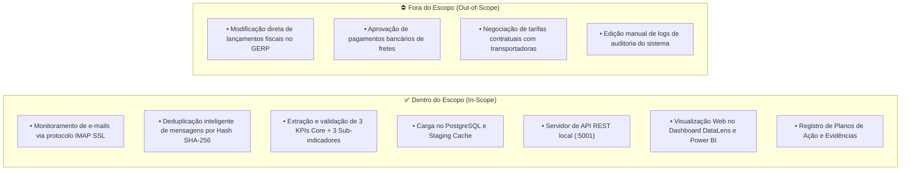
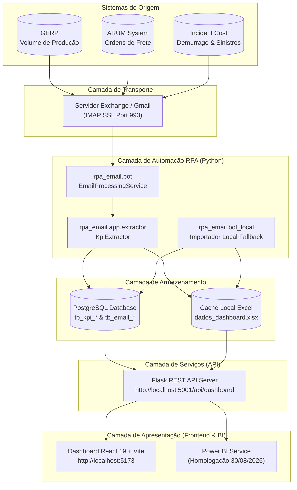
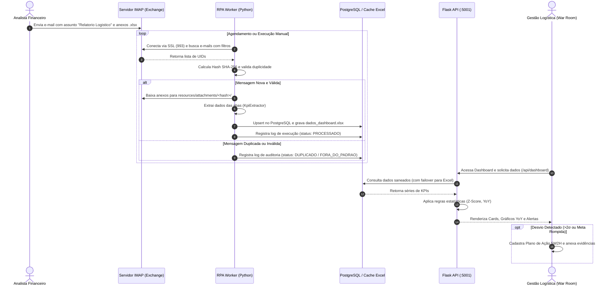
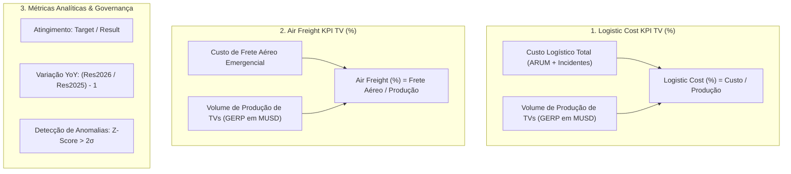
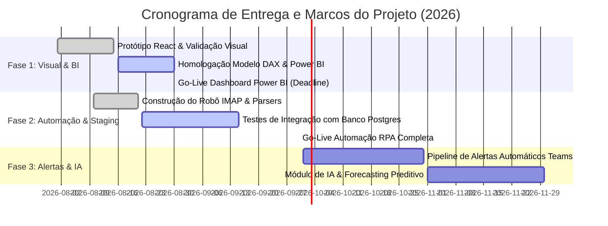

# Process Definition Document (PDD)
## Automação e Consolidação de KPIs Logísticos — Plataforma DataLens

---

### Controle do Documento

| Informação | Detalhe |
|---|---|
| **Nome do Projeto** | Plataforma DataLens — Dashboard & RPA de KPIs Logísticos |
| **Código do Projeto** | DXI-LOG-KPI-2026 |
| **Área Solicitante** | Divisão de Logística & Administrativo — LG Electronics DXI |
| **Versão** | 1.0.0 |
| **Data da Versão** | 21 de Agosto de 2026 |
| **Classificação** | Confidencial — Uso Interno LG Electronics |
| **Status** | Homologado para Execução |

---

### Histórico de Revisões

| Versão | Data | Autor | Papel | Resumo das Alterações |
|---|---|---|---|---|
| **0.1.0** | 10/08/2026 | Rômulo Lira | Desenvolvedor / Automação | Estruturação inicial do pipeline de dados e testes locais. |
| **0.9.0** | 18/08/2026 | Rafael / Ruy | Usuário-Chave / Sponsor | Homologação das regras de negócio de KPIs e layout visual. |
| **1.0.0** | 21/08/2026 | Rômulo Lira | Engenharia de Processos | Formalização completa do PDD, mapeamento BPMN e arquitetura TO-BE. |

---

### Matriz de Aprovações

| Nome | Cargo / Área | Papel no Projeto | Data de Aprovação | Assinatura / Status |
|---|---|---|---|---|
| **Ruy** | Gerente Sênior / Sponsor | Sponsor Estratégico | 21/08/2026 | Aprovado |
| **Rafael** | Líder de Operações Logísticas | Product Owner / Key User | 21/08/2026 | Aprovado |
| **Esdras** | Especialista em Dados | Engenheiro de Dados / Infra | 21/08/2026 | Aprovado |
| **Rômulo Lira** | Engenheiro de Software / RPA | Tech Lead / Desenvolvedor | 21/08/2026 | Aprovado |

---

## 1. Sumário Executivo e Objetivos Estratégicos

### 1.1. Contexto Empresarial
A **LG Electronics DXI** gerencia uma complexa operação de cadeia de suprimentos voltada à fabricação e distribuição de aparelhos de Televisão (TV). Semanalmente e mensalmente, a liderança executiva realiza reuniões de **War Room** para monitorar indicadores críticos de custo logístico, fretes aéreos extraordinários, ocorrências de demurrage e faturamento de produção.

### 1.2. Problema de Negócio
Historicamente, o processo de consolidação de indicadores envolvia:
1. Extração manual e dispersa de dados de múltiplos sistemas legados (**GERP**, **ARUM**, **Incident Cost**).
2. Envio de planilhas semanais por e-mail, exigindo consolidação manual por analistas em planilhas locais.
3. Alto risco de erro humano na cópia de fórmulas e atualização de valores históricos.
4. Falta de rastreabilidade de justificativas operacionais para meses em que os custos extrapolaram a meta orçada.
5. Inexistência de um painel visual executivo centralizado para reuniões estratégicas de War Room.

### 1.3. Objetivos do Projeto
- **Automatizar 100% da captura de dados:** Robô RPA (Python) monitora a caixa de e-mails corporativa, extrai os anexos `.xlsx`, valida integridade e sanitiza os registros.
- **Armazenamento Seguro e Resiliente:** Persistência em banco relacional PostgreSQL com replicação automática em cache local estruturado (`dados_dashboard.xlsx`).
- **Detecção Inteligente de Anomalias:** Motor analítico com detecção estatística de desvios padrão ($Z\text{-Score} > 2\sigma$) e variações anormais Month-over-Month (MoM).
- **Apoio à Decisão & Governança (War Room):** Interface executiva (React / Power BI) com comparação Year-over-Year (2025 vs 2026), registro formal de Planos de Ação 5W2H e upload de evidências documentais.

---

## 2. Escopo do Processo

### 2.1. Premissas e Dependências
- As planilhas enviadas por e-mail devem conter as abas e nomes de colunas conforme o contrato de interface homologado (`month, year, target, result`).
- O servidor de e-mail deve permitir conexões via protocolo IMAP seguro (porta 993) com credenciais autorizadas.
- O ambiente operacional do robô deve dispor do interpretador Python 3.10+ com as dependências do projeto instaladas (`openpyxl`, `flask`, `flask_cors`, `psycopg2-binary`, etc.).

---

## 3. Mapeamento de Processo: AS-IS vs TO-BE

### 3.1. Comparativo de Produtividade e SLA

| Dimensão | Processo Atual (AS-IS) | Processo Futuro (TO-BE) | Ganho Obtido |
|---|---|---|---|
| **Tempo de Consolidação** | 3 a 5 horas semanais | < 15 segundos por execução | **Redução de ~99%** no tempo operacional |
| **Intervenção Manual** | 100% manual (copiar/colar) | 0% (Autônomo com fallback) | **Eliminação do trabalho repetitivo** |
| **Risco de Erro de Fórmula** | Alto (edição em planilhas abertas) | Nulo (cálculos em código validado) | **Confiabilidade absoluta dos dados** |
| **Detecção de Anomalias** | Visual / Empírica / Tardia | Automática ($Z\text{-score} > 2\sigma$) com alertas visuais | **Identificação imediata de desvios** |
| **Auditoria e Rastreabilidade** | Inexistente (arquivos soltos) | Tabela de log com hash, data e status | **100% auditável e rastreável** |
| **Disponibilização Executiva** | Slides estáticos de PowerPoint | Dashboard interativo em tempo real | **Agilidade em decisões de War Room** |

---

## 4. Atores do Processo e Matriz RACI

### 4.1. Definição dos Atores
- **Analista Financeiro (Origem):** Compila as medições dos sistemas de transporte e envia o fechamento por e-mail.
- **Robô RPA (Worker Python):** Agente de automação que processa e-mails, valida integridade e alimenta as bases.
- **Engenharia de Dados (Esdras / Rômulo):** Responsável pela infraestrutura, servidor de API, banco PostgreSQL e pipeline.
- **Líder Operacional (Rafael):** Usuário-chave que valida as informações operacionais e cria os planos de ação.
- **Sponsor Executivo (Ruy / Diretoria):** Toma decisões estratégicas no War Room com base nos indicadores consolidados.

### 4.2. Matriz RACI

| Etapa do Processo | Analista Financeiro | Robô RPA | Engenharia de Dados | Rafael (Operação) | Ruy (Sponsor) |
|---|:---:|:---:|:---:|:---:|:---:|
| 1. Fechamento e envio do e-mail semanal | **R** / **A** | I | C | I | I |
| 2. Recepção, validação e extração dos anexos | I | **R** / **A** | C | I | I |
| 3. Saneamento e persistência (DB/Excel) | I | **R** | **A** | I | I |
| 4. Disponibilização via API Server | I | I | **R** / **A** | I | I |
| 5. Análise de KPIs e Anomalias no Dashboard | I | I | I | **R** | **A** |
| 6. Registro de Planos de Ação 5W2H | I | I | I | **R** / **A** | C |
| 7. Validação Estratégica em War Room | I | I | I | C | **R** / **A** |

*Legenda: **R** = Responsável (Responsible), **A** = Aprovador/Responsável Final (Accountable), **C** = Consultado (Consulted), **I** = Informado (Informed).*

---

## 5. Arquitetura Técnica e Sistemas Envolvidos

### 5.1. Tabela de Interfaces de Sistemas

| Sistema | Tipo | Protocolo / Porta | Dados Trafegados |
|---|---|---|---|
| **Microsoft Exchange / Gmail** | Servidor de Correio | IMAP SSL / Porta 993 | Mensagens MIME com anexos `.xlsx` de custos. |
| **KpiExtractor (Python)** | Módulo de Parsing | Chamada interna Python | Tabelas abertas com `openpyxl` em modo `read_only`. |
| **PostgreSQL Database** | Banco Relacional | TCP / Porta 5432 | Tabelas: `tb_email_processing_history`, `tb_kpi_logistic_cost`, `tb_kpi_air_freight`, `tb_kpi_logistics_vs_prod`. |
| **dados_dashboard.xlsx** | Cache de Alta Disponibilidade | Sistema de Arquivos Local | Planilha consolidada com todas as abas normalizadas. |
| **Flask API Server** | Backend REST | HTTP / Porta 5001 | Endpoints `/api/dashboard` (JSON de métricas) e `/api/health` (saúde do serviço). |
| **Dashboard React 19** | Interface Web SPA | HTTP / Porta 5173 | Visualização executiva, filtros e formulários de ação. |

---

## 6. Detalhamento Passo a Passo do Fluxo TO-BE

### 6.1. Detalhamento Técnico das Etapas

#### Etapa 1 — Monitoramento e Conexão IMAP
- O robô inicializa o serviço `EmailProcessingService` carregando as variáveis do `.env`.
- Estabelece conexão segura via `imaplib.IMAP4_SSL(imap_host, imap_port)` com timeout configurado para 30 segundos.
- Efetua autenticação (`LOGIN`) e seleciona a caixa postal configurada (`INBOX`).

#### Etapa 2 — Busca Otimizada e Deduplicação Determinística
- Constrói a query de busca diretamente no servidor IMAP (`SUBJECT`, `FROM`, `SINCE`, `BEFORE`) para evitar download desnecessário de mensagens irrelevantes.
- Para cada mensagem identificada, extrai o `Message-ID` ou gera o fingerprint:
  $$\text{Fingerprint} = \text{SHA256}(\text{UID} \parallel \text{From} \parallel \text{Date} \parallel \text{Subject})$$
- Consulta o repositório de histórico. Se o status já for terminal (`PROCESSADO` ou `FORA_DO_PADRAO`), a mensagem é imediatamente ignorada, garantindo **idempotência estrita**.

#### Etapa 3 — Download e Isolamento de Anexos
- Os anexos são salvos no diretório `resources/attachments/<hash_16>/`.
- O uso de subpastas nomeadas pelo prefixo do hash SHA-256 impede qualquer risco de colisão de arquivos com o mesmo nome recebidos em datas distintas.

#### Etapa 4 — Extração e Validação Estrutural (Schema Validation)
- A classe `KpiExtractor` inspeciona a planilha com a biblioteca `openpyxl`.
- Para cada indicador, valida se as colunas obrigatórias existem:
  - `logistic_cost`, `air_freight`, `incidental_cost`, `total_cost`, `demurrage`: Requer `month`, `year`, `target`, `result`, `achievement`.
  - `logistics_vs_prod`: Requer `month`, `year`, `logisticsCost`, `productionAmount`, `ratio`.
- Linhas com meses fora de `[Jan..Dec]` ou anos fora de `[Y24..Y27]` são descartadas com log de depuração.

#### Etapa 5 — Persistência Híbrida e Resiliente
- **PostgreSQL Primário:** Realiza operações de `UPSERT` baseadas na chave primária composta `(month, year)`.
- **Excel Cache Secundário:** Atualiza e salva o arquivo `dados_dashboard.xlsx`. Caso a conexão com o PostgreSQL falhe (por exemplo, em execuções de testes locais ou indisponibilidade temporária de rede), a operação continua sem interrupções.

#### Etapa 6 — Exposição via API REST
- O servidor Flask (`api_server/server.py`) inicializa na porta 5001.
- O endpoint `/api/dashboard` responde a requisições com suporte completo a CORS para `http://localhost:5173`.
- O endpoint `/api/health` retorna o status operacional e a fonte ativa (`postgres` ou `excel_cache`).

#### Etapa 7 — Apresentação, Analytics e Tomada de Decisão
- O frontend React 19 consome o JSON e aciona o módulo `analyticsEngine.js`.
- O painel exibe:
  1. Comparação visual ano a ano (2025 vs 2026).
  2. Filtros interativos (Mês, Trimestre, Semestre e Anual).
  3. Destaque automático do melhor e do pior período.
  4. Badges de anomalia baseados em Z-Score ($> 2\sigma$).
  5. Módulo de Plano de Ação 5W2H e Área de Evidências.

---

## 7. Regras de Negócio e Fórmulas de Cálculo

### 7.1. Fórmulas Matemáticas Oficiais

#### 1. Logistic Cost KPI TV (%)
Mede o percentual do custo total de transporte em relação ao valor total produzido:
$$\text{Logistic Cost (\%)} = \frac{\text{Custo Logístico (ARUM)} + \text{Incident Cost (Despesas Incidentais)}}{\text{Volume de Produção Total (GERP)}} \times 100$$
- *Diretriz de Negócio:* Menor é melhor.

#### 2. Air Freight KPI TV (%)
Mede o impacto dos fretes aéreos emergenciais sobre o faturamento de produção:
$$\text{Air Freight (\%)} = \frac{\text{Custo de Frete Aéreo Emergencial}}{\text{Volume de Produção Total (GERP)}} \times 100$$
- *Metas Estabelecidas:* $0.40\%$ para 2025; $0.22\%$ para 2026.
- *Diretriz de Negócio:* Menor é melhor.

#### 3. Taxa de Atingimento da Meta (Achievement)
Por se tratar de um indicador de **custo** (onde valores menores representam melhor desempenho), a fórmula de atingimento inverte a razão tradicional:
$$\text{Achievement} = \frac{\text{Target (\%)}}{\text{Result (\%)}}$$
- Se $\text{Achievement} \ge 1.0$ ($100\%$): **Meta Atingida (Dentro do Orçamento)**.
- Se $\text{Achievement} < 1.0$ ($< 100\%$): **Meta Não Cumprida (Estouro de Custo)**.

#### 4. Variação Ano a Ano (Year-over-Year — YoY %)
Compara o desempenho do mesmo mês entre 2025 e 2026:
$$\text{YoY (\%)} = \left( \frac{\text{Resultado}_{2026}}{\text{Resultado}_{2025}} - 1 \right) \times 100$$

#### 5. Detecção Estatística de Anomalias (Z-Score & Desvio Padrão)
Um ponto de dado é marcado automaticamente com o badge de **Anomalia Operacional** se o seu resultado estiver a mais de 2 desvios padrão da média da série histórica:
$$\mu = \frac{1}{N} \sum_{i=1}^{N} x_i \quad , \quad \sigma = \sqrt{\frac{1}{N-1} \sum_{i=1}^{N} (x_i - \mu)^2}$$
$$Z = \frac{|x_i - \mu|}{\sigma} \quad \longrightarrow \quad \text{Se } Z > 2.0 \implies \mathbf{ANOMALIA}$$

---

## 8. Tratamento de Exceções e Matriz de Riscos

### 8.1. Matriz de Exceções de Negócio e de Sistema

| Código de Erro | Tipo de Exceção | Causa Raiz | Comportamento do Sistema | Ação Corretiva / Contingência |
|---|---|---|---|---|
| **EXC-NEG-001** | Negócio | E-mail com assunto fora do padrão configurado no `.env`. | Registra status `FORA_DO_PADRAO` no banco de controle e ignora o arquivo. | Notificar o remetente financeiro para utilizar o assunto homologado `Relatorio Logistico`. |
| **EXC-NEG-002** | Negócio | Remetente não autorizado ou não correspondente ao `EMAIL_SENDER_FILTER`. | Registra log de auditoria com detalhes e descarta o e-mail. | Atualizar a lista de remetentes no arquivo de configuração se for uma substituição de analista. |
| **EXC-NEG-003** | Negócio | Planilha `.xlsx` sem colunas obrigatórias (`month`, `target`, `result`). | Gera log de inconsistência de schema (`KpiExtractor`) e ignora a aba corrompida. | Analista financeiro reenvia o arquivo com o template padrão de colunas. |
| **EXC-SYS-001** | Sistema | Falha de autenticação IMAP ou servidor de e-mail indisponível. | Interrompe o ciclo com log de erro `[EMAIL] Falha de conexao` e encerra com código de saída `1`. | Robô tenta reconectar no próximo ciclo agendado; equipe de infraestrutura valida credenciais. |
| **EXC-SYS-002** | Sistema | Banco de dados PostgreSQL inacessível ou fora do ar. | Exibe aviso `[DB] PostgreSQL indisponivel`, ativa o failover e salva no `dados_dashboard.xlsx`. | A aplicação continua operando 100% via cache local. Quando o banco retornar, o robô sincroniza automaticamente. |
| **EXC-SYS-003** | Sistema | Tentativa de processar e-mail já processado anteriormente. | Identifica hash existente na tabela de controle e ignora a mensagem com log `[DUPLICADO]`. | Comportamento padrão de segurança (idempotência preservada). |

---

## 9. Requisitos Não Funcionais, Segurança e Governança

### 9.1. Segurança e Privacidade de Dados
- **Gestão de Segredos:** Todas as credenciais de acesso (`EMAIL_USER`, `EMAIL_PASSWORD`, `DATABASE_URL`) são estritamente isoladas em arquivos `.env` protegidos pelo `.gitignore`. Nenhuma senha ou chave trafega em código-fonte aberto.
- **Criptografia em Trânsito:** Toda a comunicação externa de correio eletrônico ocorre exclusivamente sobre protocolo criptografado **IMAP SSL (TLS 1.2+) na porta 993**.
- **Isolamento de Diretórios:** Os arquivos anexados recebem hashes SHA-256 nos diretórios de download, evitando exposição ou substituição acidental de dados em disco.

### 9.2. Desempenho e Volumetria
- **Tempo de Resposta da API:** $< 50\text{ ms}$ para carregamento completo dos dados via cache.
- **Consumo de Memória do RPA:** $< 120\text{ MB}$ por ciclo de execução.
- **Volumetria Estimada:** 4 a 10 e-mails por mês, totalizando aproximadamente 1.000 linhas de KPIs por ano, volume idealmente suportado tanto pelo PostgreSQL quanto pelo cache Excel.

---

## 10. Plano de Testes, Critérios de Aceite e Homologação

### 10.1. Roteiro de Testes Homologados

| ID do Teste | Cenário de Teste | Procedimento de Validação | Critério de Aceite | Status |
|---|---|---|---|:---:|
| **TC-01** | Extração de E-mail via IMAP | Enviar e-mail com anexo da pasta `kpi_reports/` e rodar `python -m rpa_email.bot`. | Anexo baixado, dados extraídos e gravados no banco/Excel sem erros. | **Aprovado** |
| **TC-02** | Teste de Carga Local (Sem E-mail) | Alterar valor em `kpi_reports/relatorio_logistic_cost.xlsx` e rodar `python -m rpa_email.bot_local`. | Valor atualizado imediatamente refletido no dashboard com F5. | **Aprovado** |
| **TC-03** | Tolerância a Falhas de Banco | Desconectar a URL do PostgreSQL e executar a API e o robô. | API entra em modo failover para `dados_dashboard.xlsx` e responde `200 OK`. | **Aprovado** |
| **TC-04** | Deduplicação de Mensagens | Executar o robô duas vezes consecutivas para o mesmo e-mail. | Na segunda execução o resumo exibe `duplicados=1` e não reprocessa. | **Aprovado** |
| **TC-05** | Responsividade e Tipografia | Acessar o Dashboard em resoluções de 1920x1080, 1366x768 e mobile. | Legendas sem cortes visuais e números formatados em fonte tabular. | **Aprovado** |

---

## 11. Roadmap de Implantação e Marcos Críticos

---

*Documento formalmente elaborado pela equipe de Engenharia de Automação e aprovado pelos Stakeholders da LG Electronics DXI.*
